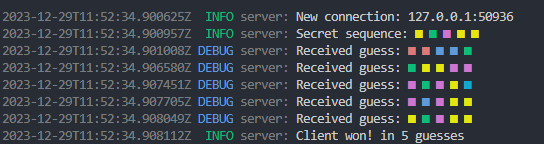
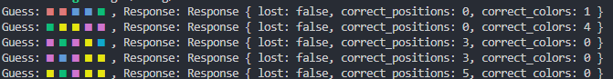
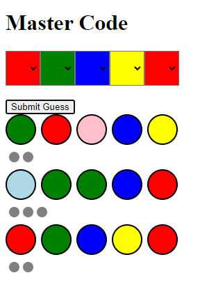

# Master Code

Game inspired by the Mastermind board game.

## Description

The game is played by two players, the code maker and the code breaker. The code maker creates a code of 5 colors, and the code breaker has to guess the code in 6 turns. After each guess, the code maker gives feedback to the code breaker. The feedback consists of black and white pegs. A black peg means that the code breaker has guessed a color correctly and that it is in the right position. A white peg means that the code breaker has guessed a color correctly, but it is in the wrong position.
(If a black peg is given, the code maker does not give a white peg for the same color in the code.)
The code breaker wins if he guesses the code in 6 turns. The code maker wins if the code breaker does not guess the code in 6 turns.

## Workspace

The workspace consists of 4 folders:
- **common**: contains the common code for the different projects around the game
- **server**: is a server that creates a readom code and gives feedback to the client

- **client**: is an IA that tries to guess the code in 6 turns or less

- **player**: is a web application that allows a human player to play. (independent from the other folders)
